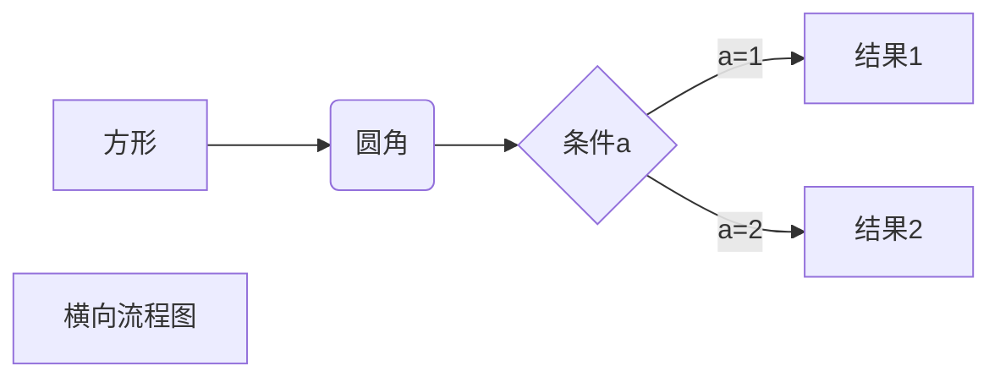

# 一级标题

## 二级标题

### 三级标题

#### 四级标题

##### 五级标题

###### 六级标题

换行注意了

要实际空一行就是
这么的个性

1、 第一项

2、 第二项

3、 第三项

5、 第四项

```
来写代码了，但是这个符号用着不顺手还得多多练习呀
```

行内代码 `是这样的吗？`

有序列表

1. 123

2. 344

3. 23232

4. ded

5. dddd
   
   1. 这样是
      1. 还是这样
         1. 原来是这样啊
            1. 好多层呀

无序列表

- 原来是这么的简单
- 一个横杠变成了一个点
  - 原来还可以分级呀
    1. 早点咋不知道呢？
    2. 心累呀

加粗

***三个型号是斜体加粗***

*一个星号是斜体吗？*

**两个星号是加粗** 

使用星号分割线

***

使用减号分割线

----

下划线分割线

___

段落  这是一段？  
来了哦，原来这样也是可以的呀

这样也是可以的，在末尾加两个空格  
就是换行

直接敲两个回车也是换行，不过这样换行间距大
一个回车是不换行的。

删除线 ~~删除了~~ 一边两个波浪线就是删除线~~一个是不行的~~

下划线
<u>下划线</u>

脚本是这样的[^什么？]

[^这里是说明]

区块  

> 最外层  
> 
> > 这是第二层  
> > 
> > > 第二层的第一层

区块中的顺序

> 第一层
> 
> > 1. 第一层的第一层
> > 2. 第一层的第二层

1. 第一张
   
   > 这是第一张
   > 
   > > 第一张的第二张

这是代码

      java哦，这样也是可以做代码块的呀，刚刚知道，这多好
    
      是吧

可以使用````来指定一种国语言

```java
当然也可以不指定

public static void main(String[] args){

}
```

这样的好处就是还有颜色

    空格指定的是没有颜色的
    public static void main(){
    
    }
    因为没有指定语言

markdown链接

这是一个链接 [百度](https://baidu.com)

直接一个链接
<https://baidu.com>


高级链接变量[百度][1]

数字名字都是可以的[谷歌][google]

[google]:https://google.com

表格

| 表头  | 表头      |
| --- | ------- |
| 第一行 | 第二列     |
| 张三  | 李四      |
| 王武  | 找流吗?dsf |

| 左对齐 | 右对齐 | 居中对齐 |
|:--- | ---:|:----:|

流程图都可以画呀，太厉害了



[1]:https://baidu.com